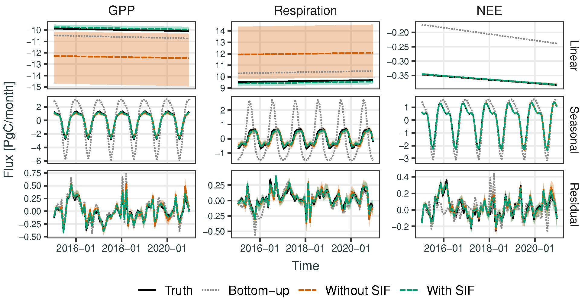

# WOMBAT v2.S: A Bayesian inversion framework for attributing global CO<sub>2</sub> flux components with multiprocess data

This repository contains code to reproduce the results in the paper [WOMBAT v2.S: A Bayesian inversion framework for attributing global CO<sub>2</sub> flux components with multiprocess data](). This README assumes familiarity with the paper. Unless stated otherwise, all commands are to be run in the root directory of the repository.

<p align="center">
  
</p>

The figure above shows posterior flux estimates for GPP, respiration, and (their sum) NEE, each decomposed into linear, seasonal, and residual terms. The two posterior estimates (with and without SIF) are from inversions in an observing system simulation experiment (OSSE). The true flux is represented by the black line, and notice that the true linear term for GPP and respiration is only covered by posterior prediction intervals when SIF observations are included in the inversion. The NEE estimates are minimally effected by the inclusion of SIF since NEE is well-constrained by CO<sub>2</sub> mole-fraction observations. However, attributing NEE to its GPP and respiration components is difficult without the aid of SIF observations.

<!-- # Accessing the estimated fluxes and parameters

The outputs of WOMBAT v2.S are [available on Zenodo](). These comprise samples from the posterior distribution of the model parameters as well as bottom-up estimates and samples from the posterior distribution of the fluxes. -->

# Installation and environment configuration

This workflow requires R version 4+ and Python version 3.12+, along with a variety of dependency packages in both languages. The easiest way to set up an environment in which to run this code is to use [Conda](https://docs.conda.io/). Instructions for setting up an appropriate conda environment are provided below. If you do not wish to use R through conda, you can adapt the instructions below to a local R installation. For what remains, we assume you have conda installed.

Create a conda environment and set it to use [conda-forge](https://conda-forge.org/):

```
conda create --yes --prefix .conda_env
conda activate ./.conda_env
conda config --env --add channels conda-forge
conda config --env --set channel_priority strict
```

Install conda packages

```
conda install r-base pkg-config udunits2 libgdal netcdf4 cdo nco
```

Set your CRAN mirror. WOMBAT was made in Australia, so we choose the mirror run by CSIRO, but you can pick your favourite:

```
cat > .conda_env/lib/R/etc/Rprofile.site <<- EOF
local({
  r <- getOption('repos')
  r['CRAN'] <- 'https://cran.csiro.au'
  options(repos = r)
})
EOF
```

Install R dependencies (this might take a while):

```
Rscript -e "renv::restore()"
```

Check out the required version of GEOS-Chem:

```
(cd external/GEOS_Chem && git clone --branch 12.3.2 https://github.com/geoschem/geos-chem.git Code.v12.3.2)
```

# Getting data

All input datasets go into the `data` directory. There are a few files already there, but the rest will need to be retrieved from their primary sources.

## Data required for all steps

In addition to those data sets already provided, the following data are needed to run the inversions:

- The OCO-2 Level 2 SIF Lite files, available from [NASA's GES DISC](https://disc.gsfc.nasa.gov/datasets/OCO2_L2_Lite_SIF_10r/summary). The daily Lite files concatenate daily values and they are stored within yearly subdirectories. The parent directory `OCO2_L2_Lite_SIF_10r` should be placed in the `data` directory.
- Available from the [OCO-2 v10 MIP website](https://gml.noaa.gov/ccgg/OCO2_v10mip/download.php):
  - 10-second averages of the OCO-2 B10 retrievals, in a file named `OCO2_b10c_10sec_GOOD_r5.nc4`
  - The ObsPack measurements used by the v10 MIP, `obspack_co2_1_OCO2MIP_v3.2_2021-05-20`. These should be untarred into the `data` directory.
  - The TCCON retrievals in the file `downloaded_20211217.tgz`. These were not actually used in the paper, but are required for the matching step to work.
- The Landschutzer ocean fluxes in the file `spco2_MPI-SOM_FFN_v2020.nc`, available from this [NOAA website](https://www.ncei.noaa.gov/data/oceans/ncei/ocads/data/0160558/MPI_SOM-FFN_v2020/)
- Three additional data sets are needed that are not publicly available at this time. These can be provided upon request, and we will endeavour to make them freely available. These are:
  - GFED4.1s fire emissions, preprocessed for ingestion by HEMCO
  - The SiB4 bottom-up estimates of SIF, and of GPP and respiration fluxes
  - Fossil-fuel emissions based on ODIAC postprocessed for ingestion by HEMCO
  - Data for the Lauder CO<sub>2</sub> collection site in NZ (not used in the project, but required for the matching step)

GEOS-Chem requires meteorological fields and CO<sub>2</sub> emissions to run. These go into the `data/GEOS_Chem` directory (if you already have some of these, you could symlink them in). There are instructions for how to download these files in the [GEOS-Chem User's Guide](https://geoschem.github.io/gcclassic-manpage-archive/man.GC_12/chapter_4.html).

The directories you need to download are:

```
ExtData/GEOS_2x2.5/MERRA2
ExtData/CHEM_INPUTS/MODIS_LAI_201204
ExtData/CHEM_INPUTS/Olson_Land_Map_201203
ExtData/HEMCO/CO2/v2015-04/BIOFUEL
```

## Intermediate files to reproduce just the inversion

The most computationally expensive parts of the workflow are Steps 1 and 2 below, where the basis-function runs are computed and post-processed. To ease reproduction of the inversion results (Steps 3 and 4 below), we can provide the necessarily post-processed outputs of Steps 1 and 2 needed to run the inversion and generate the results. These can be provided by the author upon request.

Once you have the archive, extract the files into the root directory of this repository with

```
tar xzf ~/path/to/WOMBAT_v2S_intermediates.tar.gz
```

Then you can run the workflow from Step 4 onwards as described below.

## Data required for OSSE and flux comparisons

Posterior samples of model parameters from the [WOMBAT v2.0](https://doi.org/10.1214/23-AOAS1790) inversion are used to create true-flux cases for the OSSE, and to produce WOMBAT v2.0 flux estimates for comparison in the results. These samples are [available on Zenodo](https://doi.org/10.5281/zenodo.8015840); the file `samples-LNLGIS.rds` should be placed in the `data` directory.

Flux estimates from [FLUXCOM X-BASE](https://doi.org/10.5194/bg-21-5079-2024) are also included in comparisons. The required files can be retrieved using the commands below, for which a [free ICOS account](https://cpauth.icos-cp.eu/home/) is needed.

```
python -m pip install icoscp_core
mkdir data/FLUXCOM_XBase
(python data/download_xbase_from_icos.py GPP 050_monthly -s 2015 -e 2020 -o data/FLUXCOM_XBase)
(python data/download_xbase_from_icos.py NEE 050_monthly -s 2015 -e 2020 -o data/FLUXCOM_XBase)
```

This will place yearly files (2015-2020) for GPP and NEE estimates aggregated to a 0.5-degree monthly resolution into the `data/FLUXCOM_XBase` directory. More details are available at https://gitlab.gwdg.de/fluxcom/fluxcomxdata. Alternatively, the individual files can be obtained from the [ICOS website](https://doi.org/10.18160/5NZG-JMJE).

# Running the workflow

The workflow of this repository is split into five steps:

1. `1_transport`: Creates GEOS-Chem basis function runs. This includes setting up the inventories, creating the run directories, and setting up the configuration files. You will then need to find a way to run GEOS-Chem for each run.
2. `2_matching`: Postprocesses the run output from the previous step by extracting the modelled mole-fraction values for each basis function at each observation time and location.
3. `3_sif`: Prepares SIF data for use in the inversions. This includes computing the 10-second observation averages, setting up the SIF inventory, fitting the SIF–GPP linear models, and extracting the SIF values for each GPP basis function at each observation time and location.
4. `4_inversion`: Performs the inversions.
5. `5_results`: Summarises the results as a series of plots, tables, and other outputs. This reproduces all the figures in the paper.

## Step 1: running transport

In this step, many runs of GEOS-Chem need to be completed, and it is by far the most computationally intensive part of the workflow. The code creates several run directories corresponding to basis functions, and then GEOS-Chem can be run in parallel for each directory.

To set up the basis-function runs, run the command:

```
WOMBAT_LOG_LEVEL=debug make -j4 1_transport_targets
```

This will set up GEOS-Chem run directories in `1_transport/intermediates/runs` and `1_transport/intermediates/runs-r10-r15-rNZ`. In each folder, there is a base run called `base`. You need to compile the base run code by changing into the directory and calling make as follows:

```
(cd 1_transport/intermediates/runs && BPCH_DIAG=n make -j24 mpbuild)
(cd 1_transport/intermediates/runs-r10-r15-rNZ && BPCH_DIAG=n make -j24 mpbuild)
```

The code for the other directories all symlink back to this directory to access the built GEOS-Chem executable.

Now you need to run all the GEOS-Chem runs in these directories, including the base run. Their outputs will require around 10TB of space. To run them, the simplest scheme is to change into a run directory and call `geos.mp`. For example:

```
(cd 1_transport/intermediates/runs/residual_20210301_part003 && OMP_NUM_THREADS=8 ./geos.mp)
```

After this is completed, you should run the `postprocess-run.sh` script in the same directory:

```
(cd 1_transport/intermediates/runs/residual_20210301_part003 && bash postprocess-run.sh)
```

It may however be easier to run these through a batch system like Slurm. Example scripts to do this are provided for the [Gadi supercomputer system run by the Australian NCI](https://nci.org.au/) in `run-gadi.sh`, and for a local Slurm setup in `run-niasra-hpc-sbatch.sh`. All the runs are independent from each other so they can be done in parallel.

### A note on the transport runs

When we first performed the basis-function runs, there was a bug in the region mask for a few regions. Because the cost of re-running all the runs is prohibitive, and most runs did not need to change, we added a second set of runs that corrects those regions. In this repository we have retained that "two run" structure: the first set of runs are in `1_transport/intermediates/runs`, and the second in `1_transport/intermediates/runs-r10-r15-rNZ`.

If reproducing the results from scratch or adapting the framework to a new problem, the second set of runs should be removed.

## Step 2: postprocessing runs (matching)

Similar to the runs above, the matching step first creates a directory for each run with scripts that need to be run to postprocess the GEOS-Chem outputs. Then, you run each of those scripts, potentially in parallel.

The directories can be created with

```
WOMBAT_LOG_LEVEL=debug make -j4 2_matching_targets
```

This will create a directory structure in `2_matching/intermediates/runs` and `2_matching/intermediates/runs-r10-r15-rNZ`, which parallels the structure in `1_transport` from the previous step.

Once that's done, there are two steps to run for each directory. The first step aggregates the basis-function fluxes to a monthly resolution. Scripts for running that on the Gadi supercomputer are in `2_matching/intermediates/runs/<RUN>/run-aggregate-flux-gadi.sh`; the script just uses [CDO](https://code.mpimet.mpg.de/projects/cdo/embedded/index.html) and can be adapted to your needs. The second step extracts those portions of the mole fraction outputs of GEOS-Chem that correspond to observations. Scripts for running that on the Gadi supercomputer are in `2_matching/intermediates/runs/<RUN>/run-matching-gadi.sh`. This calls the R script `2_matching/src/match.R` and can again be adapted to your needs.

## Step 3: incorporating SIF data

Configuration for SIF depends on the transport runs in Step 1, but it can be done in parallel with Step 2. In this step, OCO-2 SIF retrievals are processed into 10-second averages and matched to the SiB4 SIF inventory. The SIF–GPP linear models are fit using SiB4 inventories for SIF and GPP, and these fits are used when producing the SIF basis functions. This step is the least computationally demanding, and it can be run on your local system as follows
```
WOMBAT_LOG_LEVEL=debug OMP_NUM_THREADS=8 make -j4 3_sif_targets
```

## Steps 4 and 5: inversion and results

Once Steps 1-3 are completed (or you've downloaded the intermediate files mentioned earlier), you can run the inversions. The simplest way to do this is to run

```
WOMBAT_LOG_LEVEL=debug OMP_NUM_THREADS=8 make -j4 5_results_targets
```

After working through some setup steps, this will run the OSSE and real-data inversions and then generate all the plots and outputs. You can modify the `-j` option and the `OMP_NUM_THREADS` variable to suit your local system.
